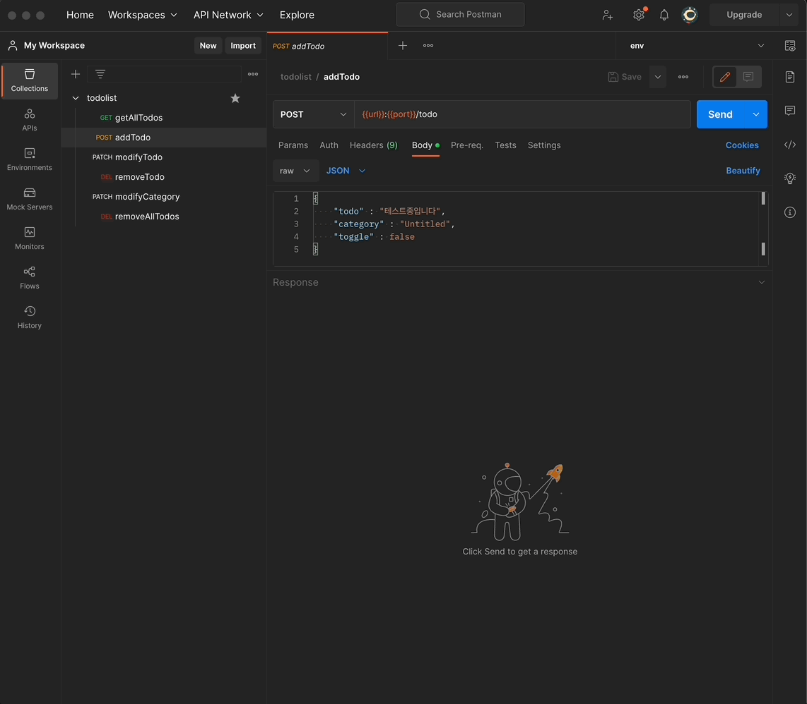
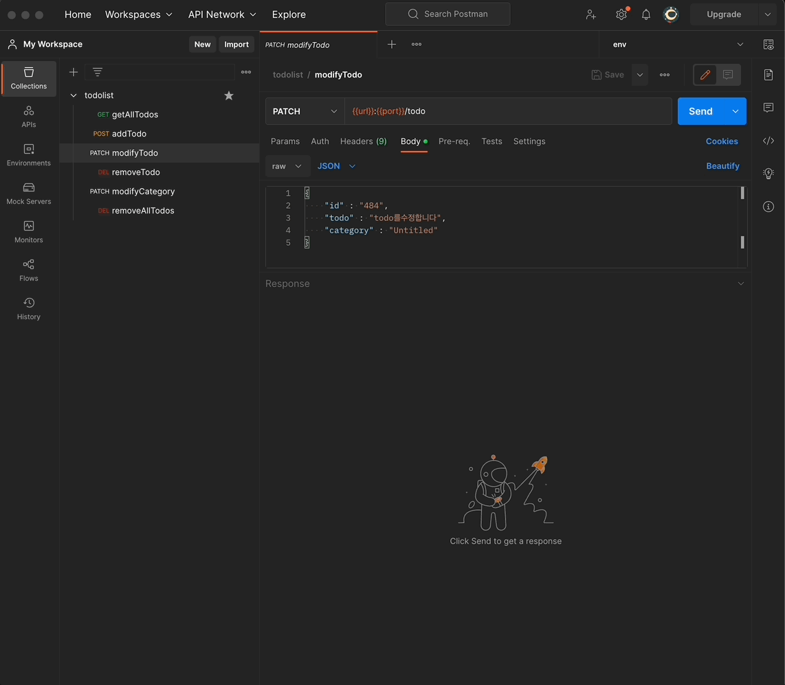
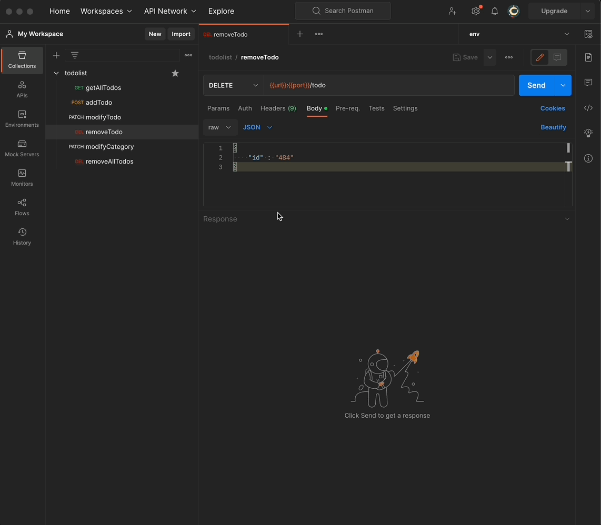
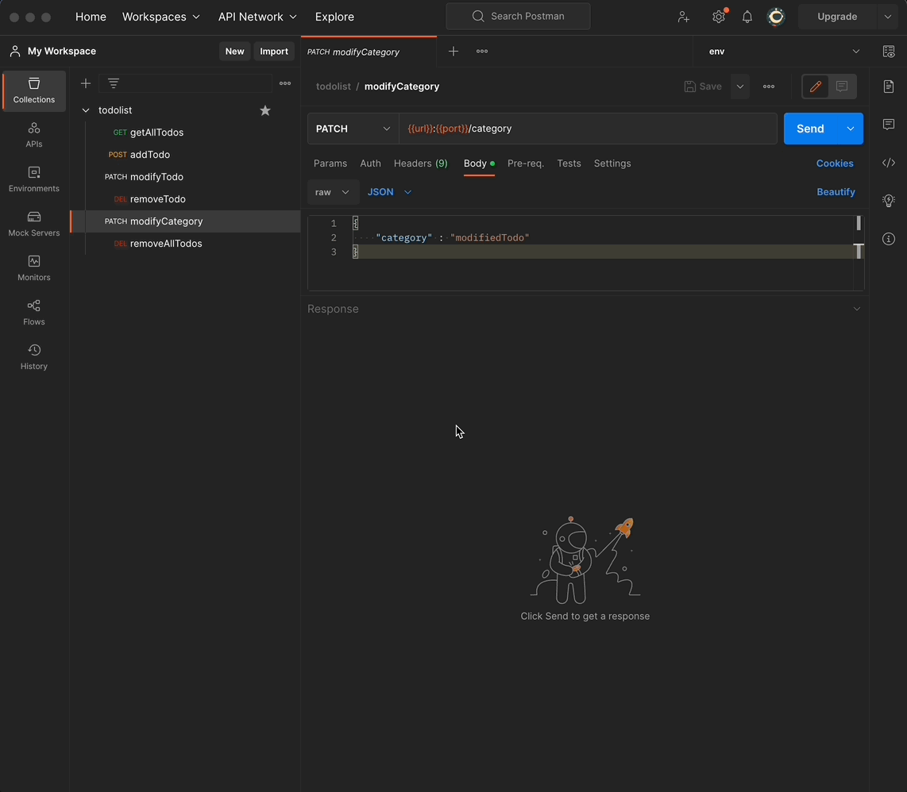

# todolist_backend(jp)

##### [한국어 버전은 이 곳을 클릭해주세요](README.md)

##### [Click here for English version](README_EN.md)

## - 目次 -

1. 概要
2. Project 目標
3. Postman API 呼び出し試演
4. 今後具現予定機能
5. 改善必要内容
    
    

### 1. 概要

- Project タイトル: todolist_backend
- 期間 : 2023.01.09 - 2023. 01. 15(7 日)
- 人員 : 1 人
- 技術スタック :  
   
  
     
   
   

### 2. Project 目標

1. todolist の為の簡単な CRUD 機能の API 製作
2. frontend server との連動出来るように具現する事
3. Postman の API 呼び出し機能を使う事
    
    

### 3. Postman API 呼び出し試演  

1. todoitem 追加 
   
2. todoitem 読み込み 
   
3. todoitem 修正 
   
4. todoitem 削除 
   
5. cetegory タイトル修正 
   
6. cetegory 内容全体削除 
   
7. Postman API 呼び出し test 
   
    
    

### 4. 今後具現予定機能

1. 二つ以上の category 表を表現する為の ERD 改善
2. もっと具体的なエラーハンドリング
    
    

### 5. 改善必要内容

1. MVC model の適用
2. 全体的な refactoring
